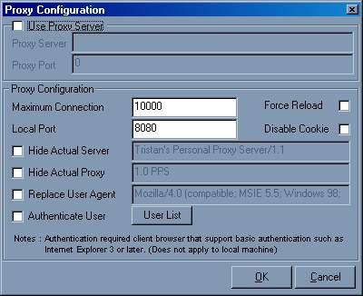



## A Personal Proxy Server \(Updated \!\!\)

### Description

A fully working HTTP Proxy Server which relay your browser client request to other proxy server or to the original host server. u can manipulate the request/response header easily with this proggie, it'll show every request/response header, so if anybody interested in seeing what really going on behind your browser, here's your change...

note : i still couldn't figure out why yahoo always response with not found error...

if anybody could pointed me where i was wrong, your comments are really appreciated.

thanks,

ian
 
### More Info
 

             |
---                |---
**Submitted On**   |2000-10-26 13:14:52
**By**             |[Ian Surya](https://github.com/Planet-Source-Code/PSCIndex/blob/master/ByAuthor/ian-surya.md)
**Level**          |Intermediate
**User Rating**    |4.6 (144 globes from 31 users)
**Compatibility**  |VB 5\.0, VB 6\.0
**Category**       |[Complete Applications](https://github.com/Planet-Source-Code/PSCIndex/blob/master/ByCategory/complete-applications__1-27.md)
**World**          |[Visual Basic](https://github.com/Planet-Source-Code/PSCIndex/blob/master/ByWorld/visual-basic.md)
**Archive File**   |[CODE\_UPLOAD1096110262000\.zip](https://github.com/Planet-Source-Code/ian-surya-a-personal-proxy-server-updated__1-11700/archive/master.zip)

